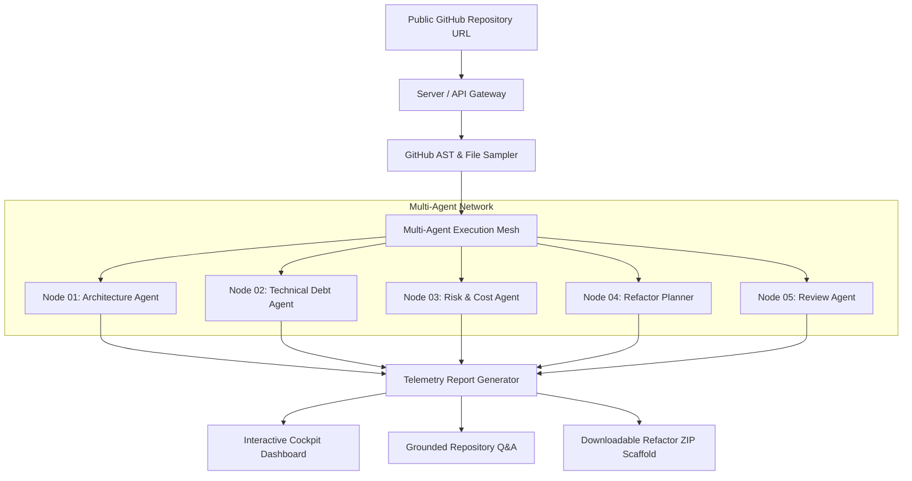

<div align="center">

# 🧬 CodeGenome AI

### **Autonomous Multi-Agent Repository Intelligence & Codebase Refactoring Engine**

[](https://react.dev/)
[](https://www.typescriptlang.org/)
[](https://vitejs.dev/)
[](https://www.framer.com/motion/)
[](https://nodejs.org/)
[](https://expressjs.com/)
[](LICENSE)

*Deconstruct complex codebases, map system architecture, price technical debt in developer hours and financial currency, and generate downloadable automated refactoring blueprints.*

[**Explore Demo**](https://github.com/raghavacse2024-dotcom/codegenome-ai) • [**Report Bug**](https://github.com/raghavacse2024-dotcom/codegenome-ai/issues) • [**Request Feature**](https://github.com/raghavacse2024-dotcom/codegenome-ai/issues)

---

</div>

## 📌 Overview

**CodeGenome AI** is a state-of-the-art codebase telemetry and automated refactoring platform powered by a cooperative mesh of 5 specialized AI execution agents. 

Given any public GitHub repository URL, CodeGenome AI performs a **100% read-only scan**, analyzes AST structures, maps module dependency boundaries, calculates technical debt indices with financial estimations, pinpoints fragile code hotspots, and generates complete, drop-in replacement TypeScript/JavaScript refactor scaffolds.

---

## ✨ Key Features

### 🌟 Interactive Animated Landing Page
- **Sleek Aesthetic**: Built with dark mode, aurora glow effects, neon accents, and responsive typography.
- **Scroll-Driven Micro-Animations**: Smooth Framer Motion `whileInView` reveals, 3D card hover tilt, step connectors, and glowing borders.
- **Live Terminal Visualization**: Interactive mockup simulating real-time agent node telemetry streams.
- **Interactive FAQ Accordion**: Instant answers to common security, performance, and API questions.

### 🤖 5-Agent AI Mesh Pipeline
- 🧬 **Architecture Agent**: Maps entrypoints, module dependency graphs, cycle bindings, and system boundary layers.
- 💰 **Technical Debt Agent**: Calculates cyclomatic complexity load, refactor effort hours, and financial cost estimates.
- 🎯 **Risk & Cost Agent**: Scans for high-churn fragile files, complexity bottlenecks, and bug propagation hotspots.
- 🛠️ **Refactor Planner**: Generates clean, modular code blueprints with updated typings, docstrings, and decoupled patterns.
- 🔍 **Review Agent**: Ensures AST compliance, zero breaking changes, and read-only protocol verification.

### 📊 Comprehensive Telemetry Reports
- **Health & Debt Index Scorecards**: Real-time numerical scores (e.g. `84/100`), effort estimations, and financial pricing.
- **Hotspot Fragility Heatmap**: Pinpoints critical files with high cyclomatic complexity and risk metrics.
- **Language Distribution Bar**: Visual breakdown of repository languages (TypeScript, JavaScript, Python, Go, etc.).

### 💬 Grounded Repository Q&A & 1-Click Code Export
- **Repository Q&A Assistant**: Ask natural-language questions about any module, architecture pattern, or refactoring strategy.
- **Instant ZIP Export**: Download complete refactored code scaffold ZIP bundles ready for review and integration.

---

## 🏗️ Architecture & Multi-Agent Workflow



---

## 🚀 Getting Started

### Prerequisites

- **Node.js**: v18.0.0 or higher
- **npm**: v9.0.0 or higher

### Local Installation

1. **Clone the Repository**
   ```bash
   git clone https://github.com/raghavacse2024-dotcom/codegenome-ai.git
   cd codegenome-ai
   ```

2. **Install Dependencies**
   ```bash
   npm install
   ```

3. **Configure Environment Variables**
   ```bash
   cp .env.example .env
   ```

4. **Launch Development Server**
   ```bash
   npm run dev
   ```

5. **Access the Application**
   - **Frontend UI**: [http://localhost:5173](http://localhost:5173)
   - **Backend API**: [http://localhost:3001](http://localhost:3001)

---

## ⚙️ Environment Variables

Create a `.env` file in the root directory:

| Variable | Required | Description | Default |
| :--- | :---: | :--- | :--- |
| `PORT` | Optional | Port for Express backend server | `3001` |
| `VITE_API_URL` | Optional | Frontend API base URL | `http://localhost:3001` |
| `OPENAI_API_KEY` | Optional | Key for OpenAI LLM reasoning | *Demo mode active if unset* |
| `OPENAI_MODEL` | Optional | Model identifier (e.g. `gpt-4o`, `gpt-4-turbo`) | `gpt-4-turbo` |
| `GITHUB_TOKEN` | Optional | GitHub Personal Access Token for higher rate limits | *Unauthenticated limits if unset* |

> **Note**: Without `OPENAI_API_KEY` or `GITHUB_TOKEN`, CodeGenome AI operates seamlessly in **Demo Mode**, utilizing representative deterministic analysis algorithms.

---

## 🔌 API Endpoints Reference

| Method | Endpoint | Description |
| :--- | :--- | :--- |
| `GET` | `/api/health` | Returns service health status, timestamp, and mode (Live/Demo). |
| `POST` | `/api/analyze` | Accepts `{ url: string }`, runs 5-agent scan, and returns telemetry report. |
| `POST` | `/api/download` | Accepts `{ analysisId: string }` and streams a ZIP refactor scaffold bundle. |
| `POST` | `/api/qa` | Accepts `{ analysisId, question }` and returns grounded repository answers. |

---

## 🧪 Testing & Verification

Run the automated Vitest test suite covering URL validation, repository sampling, rate-limit fallback, and multi-agent orchestration:

```bash
# Run unit & contract tests
npm test

# Build production bundle
npm run build
```

---

## 🌐 Deploy to Render

This application includes a pre-configured `render.yaml` for 1-click deployment on Render:

1. Push your repository to GitHub.
2. Go to [Render Blueprint Dashboard](https://dashboard.render.com/blueprint/new).
3. Connect `https://github.com/raghavacse2024-dotcom/codegenome-ai`.
4. Apply the Blueprint configuration.
5. Optionally configure `OPENAI_API_KEY` and `GITHUB_TOKEN` in Render Environment Settings.

---

## 🛠️ Technology Stack

- **Frontend**: React 18, TypeScript, Vite, Framer Motion, Lucide React, Tailwind CSS
- **Backend**: Node.js, Express.js, Archiver, JSZip, OpenAI API
- **Testing**: Vitest
- **Deployment**: Render Blueprint (`render.yaml`)

---

## 📄 License

Distributed under the **MIT License**. See `LICENSE` for more information.

<div align="center">
  <sub>Built with ❤️ for modern software engineering teams.</sub>
</div>
