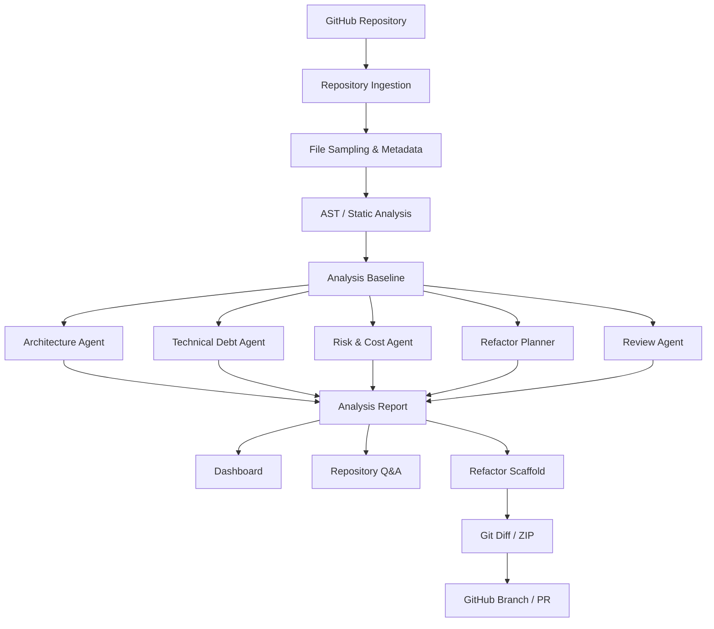

# CodeGenomeAI

### AI-powered GitHub repository intelligence, static analysis, and refactoring assistance.

CodeGenomeAI helps developers understand complex repositories by combining **AST-based static analysis, deterministic engineering heuristics, and specialized AI agents**. It analyzes repository structure, identifies complexity and technical-debt hotspots, estimates risk and maintenance effort, answers questions about the analyzed codebase, and generates refactoring scaffolds that can be reviewed and optionally turned into GitHub pull requests.

> **Important:** Repository analysis is currently sample-based and results should be treated as analysis/recommendation output, not as a guarantee of repository-wide correctness or behavior-preserving refactoring.

---

## Why CodeGenomeAI?

Large codebases are difficult to understand quickly. Developers often spend significant time answering questions such as:

- Where are the architectural boundaries?
- Which files are becoming difficult to maintain?
- Where is complexity concentrated?
- What areas represent the highest refactoring risk?
- What should be refactored first?
- How can an improvement be turned into a concrete code change?

CodeGenomeAI turns these questions into a structured analysis workflow.

---

## Core Features

### 1. Repository Intelligence

Connect a GitHub repository and build a structured snapshot containing:

- Repository metadata
- Source-file sampling
- Language distribution
- Entry-point detection
- Project structure
- Dependency and circular-dependency signals

The ingestion layer supports authenticated GitHub access and includes fallback behavior for demo/degraded environments.

### 2. AST & Static Analysis

CodeGenomeAI does not rely entirely on an LLM.

Its analysis pipeline uses deterministic code analysis to calculate signals such as:

- Cyclomatic complexity
- File-level complexity scores
- Hotspot detection
- Dependency relationships
- Circular dependencies
- Architecture boundary violations
- Language and repository structure

These signals form the baseline that AI agents can enhance.

### 3. Five Specialized Analysis Agents

The platform organizes analysis into five focused agents:

| Agent | Responsibility |
|---|---|
| **Architecture** | Maps layers, entry points, boundaries, and dependency issues |
| **Technical Debt** | Identifies complexity and maintainability hotspots |
| **Risk & Cost** | Converts technical signals into priority and maintenance-cost estimates |
| **Refactor Planner** | Produces concrete refactoring plans and code scaffolds |
| **Review** | Reviews the generated recommendations against available analysis evidence |

AI enhancement can use **Google Gemini** or an **OpenAI-compatible provider**, with deterministic analysis available as a fallback.

### 4. Real-Time Analysis

Analysis progress can be streamed to the frontend using **Server-Sent Events (SSE)**.

Users can see agent lifecycle events while the repository is being analyzed rather than waiting for a single opaque response.

### 5. Technical-Debt Dashboard

The dashboard presents analysis results through:

- Health/debt indicators
- Complexity metrics
- Hotspot lists
- Language distribution
- Risk and cost estimates
- Refactoring recommendations
- Agent execution status

### 6. Repository Q&A

Ask natural-language questions about an analyzed repository and its findings.

The Q&A workflow uses the stored analysis context to answer questions about architecture, complexity, risks, and refactoring recommendations.

### 7. Refactoring Scaffolds

CodeGenomeAI can generate:

- Refactoring steps
- Focused module scaffolds
- Test scaffolds
- Git diffs
- Downloadable ZIP bundles

These outputs are intended for developer review and integration rather than being presented as guaranteed drop-in replacements.

### 8. GitHub Pull Request Workflow

With appropriate GitHub authorization, CodeGenomeAI can prepare changes and interact with GitHub to:

1. Create a branch
2. Fork the repository when required
3. Build Git trees and commits
4. Push the generated changes
5. Create a pull request or provide a GitHub comparison URL

Without write authorization, the system falls back to a review-ready patch workflow.

---

## Architecture


```mermaid
flowchart TD
    A[GitHub Repository] --> B[Repository Ingestion]
    B --> C[File Sampling & Metadata]
    C --> D[AST / Static Analysis]

    D --> E[Analysis Baseline]

    E --> F[Architecture Agent]
    E --> G[Technical Debt Agent]
    E --> H[Risk & Cost Agent]
    E --> I[Refactor Planner]
    E --> J[Review Agent]

    F --> K[Analysis Report]
    G --> K
    H --> K
    I --> K
    J --> K

    K --> L[Dashboard]
    K --> M[Repository Q&A]
    K --> N[Refactor Scaffold]

    N --> O[Git Diff / ZIP]
    O --> P[GitHub Branch / PR]
```

### Hybrid Analysis Model

The core design intentionally combines deterministic analysis with AI:

```
Repository
    ↓
Static / AST Analysis
    ↓
Deterministic Baseline
    ↓
AI Enhancement
    ↓
Structured Findings
    ↓
Developer Review
```

This allows the application to remain useful even when an AI provider is unavailable.

---

## Technology Stack

### Frontend

- React 18
- TypeScript
- Vite
- Tailwind CSS
- Framer Motion
- Lucide React
- React Markdown

### Backend

- Node.js
- Express.js
- Zod
- OpenAI SDK
- Google GenAI SDK
- JSZip
- Archiver

### Analysis

- AST-based static analysis
- Cyclomatic-complexity analysis
- Dependency analysis
- Deterministic heuristics
- Multi-agent AI orchestration

### Data & Authentication

- Firebase / Firestore
- GitHub OAuth
- GitHub Personal Access Tokens
- GitHub REST API

### Testing & Deployment

- Vitest
- TypeScript checks
- Vite production builds
- Render deployment configuration

---

## Analysis Flow

A typical repository analysis follows this workflow:

```
1. GitHub repository URL
          ↓
2. Repository metadata + source sampling
          ↓
3. AST and dependency analysis
          ↓
4. Deterministic analysis baseline
          ↓
5. Five specialized analysis agents
          ↓
6. Structured telemetry report
          ↓
7. Dashboard + repository Q&A
          ↓
8. Refactoring scaffold
          ↓
9. Optional GitHub branch / PR workflow
```

---

## AI Providers

CodeGenomeAI supports AI enhancement through:

- **Google Gemini**
- **OpenAI-compatible APIs**

The OpenAI-compatible configuration can also support compatible providers through a configurable base URL.

When an AI provider is unavailable, the system can fall back to deterministic analysis.

---

## Repository Coverage

To keep analysis responsive and control resource usage, CodeGenomeAI currently uses repository/file sampling limits.

This means results should be interpreted as:

> **Analysis of the sampled repository context**

rather than a guarantee that every file in a very large repository has been analyzed.

A future direction is a full repository indexing and retrieval architecture for deeper repository-wide analysis.

---

## Security & Reliability

CodeGenomeAI is designed around a read-oriented repository analysis workflow and includes validation, timeouts, caching, provider fallback, and structured error handling.

Security hardening areas include:

- Authentication and authorization
- Secure GitHub OAuth state handling
- Firestore ownership rules
- Secret detection/redaction
- Prompt-injection defenses for untrusted repository content
- Rate limiting and AI budget controls
- Isolated validation of generated refactoring changes

Generated refactoring should always be reviewed by a developer before being merged.

---

## API

Core backend endpoints include:

| Method | Endpoint | Purpose |
|---|---|---|
| GET | `/api/health` | Service health and mode |
| POST | `/api/analyze` | Start repository analysis |
| GET/POST | `/api/analyze/stream` | Stream analysis progress |
| GET | `/api/history` | Retrieve user analysis history |
| GET | `/api/analysis/:id` | Retrieve a saved analysis |
| POST | `/api/qa` | Ask questions about an analysis |
| POST | `/api/download` | Download generated refactoring artifacts |

---

## Getting Started

### Prerequisites

- Node.js 18+
- npm 9+

### 1. Clone

```bash
git clone https://github.com/raghavacse2024-dotcom/codegenome-ai.git
cd codegenome-ai
```

### 2. Install dependencies

```bash
npm install
```

### 3. Configure environment

Copy the example environment file:

```bash
cp .env.example .env
```

Configure the providers and integrations you want to use.

### 4. Run locally

```bash
npm run dev
```

### 5. Verify the project

```bash
npm test
npm run lint
npm run build
```

---

## Environment Variables

The exact environment configuration is documented in `.env.example`.

Common configuration includes:

| Variable | Purpose |
|---|---|
| `PORT` | Express server port |
| `VITE_API_URL` | Frontend API URL |
| `GEMINI_API_KEY` | Google Gemini access |
| `GEMINI_MODEL` | Gemini model selection |
| `OPENAI_API_KEY` | OpenAI-compatible provider access |
| `OPENAI_MODEL` | OpenAI-compatible model selection |
| `OPENAI_BASE_URL` | Optional compatible-provider endpoint |
| `GITHUB_TOKEN` | Optional GitHub API access |
| `GITHUB_CLIENT_ID` | GitHub OAuth application ID |
| `GITHUB_CLIENT_SECRET` | GitHub OAuth application secret |

Never commit secrets to the repository.

---

## Testing

Run the automated test suite:

```bash
npm test
```

Run the TypeScript check:

```bash
npm run lint
```

Create a production frontend build:

```bash
npm run build
```

---

## Project Structure

```
codegenome-ai/
├── server/
│   ├── agents.js
│   ├── github.js
│   ├── contracts.js
│   ├── routes/
│   │   ├── analyze.js
│   │   ├── auth.js
│   │   ├── download.js
│   │   ├── health.js
│   │   ├── pr.js
│   │   └── qa.js
│   └── services/
│       ├── analysisEngine.js
│       ├── analysisStore.js
│       ├── astAnalyzer.js
│       ├── diffService.js
│       ├── firestoreServer.js
│       ├── prService.js
│       └── scaffoldGenerator.js
│
├── src/
│   ├── components/
│   ├── hooks/
│   ├── services/
│   └── ...
│
├── docs/
├── scripts/
├── firestore.rules
├── render.yaml
├── package.json
└── README.md
```

---

## Roadmap

### Current Foundation

- GitHub repository ingestion
- AST/static analysis
- Five-agent analysis pipeline
- SSE progress streaming
- Analysis dashboard
- Repository Q&A
- Refactoring scaffolds
- GitHub branch/commit/PR workflow
- Persistent analysis history

### Next Improvements

- Full repository indexing
- Code-aware retrieval for deeper Q&A
- Secure sandbox validation of generated refactors
- Automated tests/lint/typecheck/build before PR creation
- Stronger Firestore ownership rules
- Improved OAuth/session security
- Secret scanning and redaction
- More robust PR safety controls
- Broader language support

---

## Design Principles

CodeGenomeAI follows a few core principles:

**Evidence before speculation**  
Static analysis provides measurable signals before AI enhancement.

**AI as an engineering assistant**  
AI generates recommendations and scaffolds; developers remain responsible for reviewing changes.

**Graceful degradation**  
The application should remain useful when an AI provider or authenticated GitHub access is unavailable.

**Developer-controlled changes**  
Generated changes should be inspectable through diffs and reviewed before integration.

---

## License

MIT License.

---

<div align="center">

**CodeGenomeAI**

*From complex codebases to actionable engineering insights.*

</div>
